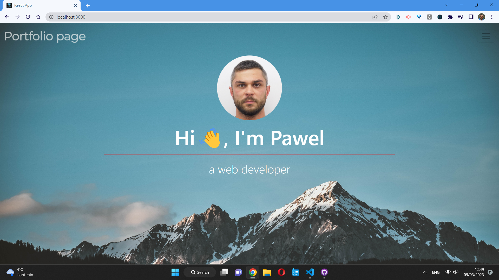

# My React Portfolio

[](https://opensource.org/licenses/MIT)

## Description

This is my portfolio webpage made with React.js

## Table of Contents

**[User&nbsp;Story](#User Story)**<br>

**[Installation](#Installation)**<br>

**[Deployment](#Deployment)**<br>

**[License](#License)**<br>

**[Contributing](#Contributing)**<br>

**[Resources](#Resources)**<br>

**[Questions](#Questions)**<br>

## User Story

AS a web developer <br>
I WANT create a webpage that shows my work and ways to contact me<br>
SO THAT I impress my future employer and get hired <br>
SO THAT I can work on more amazing projects and do what I already love

## Installation

To install necessary dependencies run the following commands:

```
npm install --save react-router-dom
```

```
npm install reactstrap react react-dom
```

```
npm install gh-pages --save-dev
```

## Deployment

Click on the link below to open the page:

After running the app your generated team page should look similar to this:



## License

This project is licensed under the MIT license.

## Contributing

You need to fork this repository and submit a pull request.

## Resources

The navbar component code was taken from:

https://reactstrap.github.io/?path=/docs/components-navbar--navbar

Background image taken from:

https://www.pexels.com/

## Questions

If you have any questions about this project, open an issue or contact me directly at
pawel.werbowy@gmail.com. If you want to take a look at more of my work click on the following link:
https://github.com/Pav85. Thank you for your time and I hope you enjoyed.
